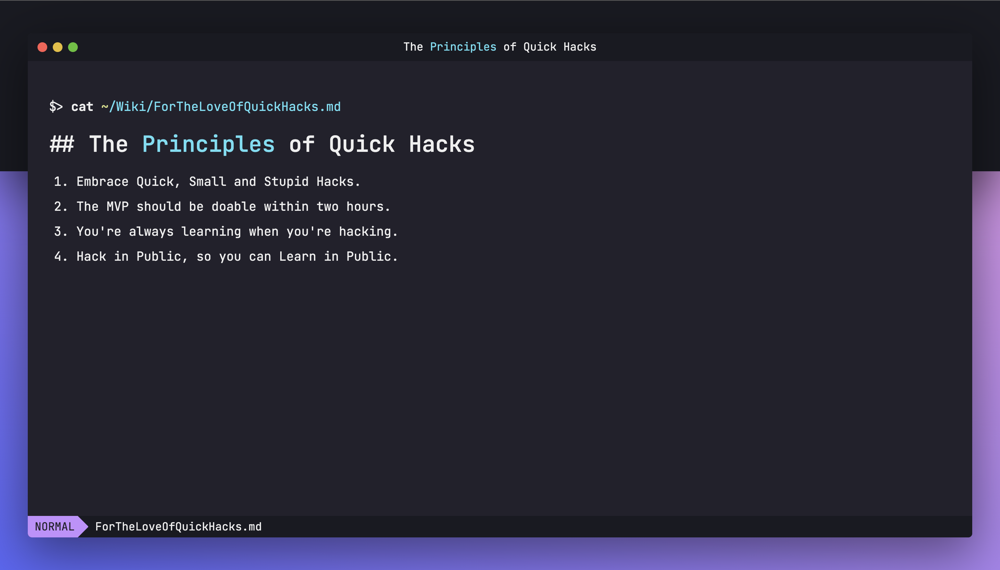

# Terminal UI with CSS

## Wait what?

This is a midnight quick hack to build a dumb-looking terminal-like proof-of-concept with CSS, since I can't bring myself to sleep.

> I guess this is my version of "Counting Sheep", except it's a lot harder to sleep now.

This is a quick CSS replica of the slide designs I made with Keynote. Turns out that anything you made with Keynote, that's also super easy to make with CSS. Cool!

I might use this in my personal site or for TerminalDaily.com later.
